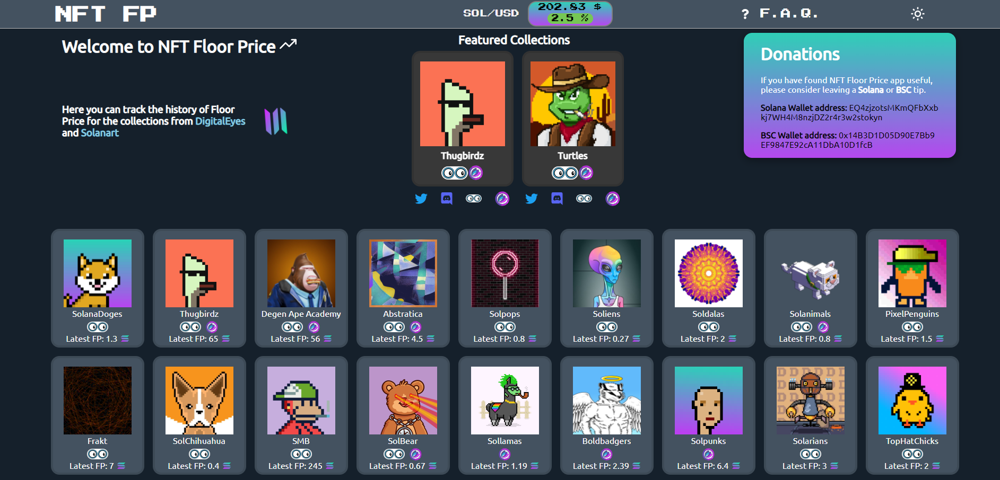

	Visit the website on: <a href="https://www.nftfloorprice.art/">nftfloorprice.art</a>

This website aims to keep track of the floor price history from Solana NFT collections. The sample frequency is at 1hour at the moment.

So far it fetches data from the largest NFT Marketplaces in Solana Ecosystem: [Solanart](https://solanart.io), [DigitalEyes](https://digitaleyes.market/) and [MagicEden](https://magiceden.io/)

If you need a collection to be added, just message me on Discord: Nivoa#4968 :)

## Tech Stack

🌄 **NEMN** - For the frontend I used NextJS, for the backend NodeJS & Express and for the database MongoDB.

## 🎁 Donating

- **SOL address**: EQ4zjzotsMKmQFbXxbkj7WH4M8nzjDZ2r4r3w2stokyn
- **BSC address**: 0x14B3D1D05D90E7Bb9EF9847E92cA11DbA10D1fcB

## 📣 Social network

- 💭 [Twitter](https://twitter.com/ESArnau) @ESArnau

## Contributors

This is my first website and I'm quite new to programming. The largest contributor (and only one) has been my 18yo brother [Marc2332](https://github.com/marc2332), without him it would not have been possible (or would have taken much longer) 😃

